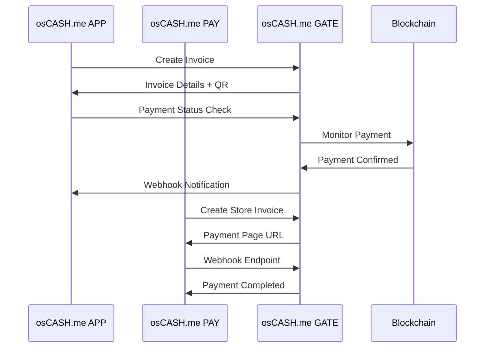

# osCASH.me Ecosystem Architecture

**Stand: 29. August 2025**

## 🎯 Ecosystem Overview

**osCASH.me** = **APP** + **PAY** + **GATE** (Vollständiges Payment-Ökosystem)

```
┌─────────────────┐    ┌─────────────────┐    ┌─────────────────┐
│   osCASH.me     │    │   osCASH.me     │    │   osCASH.me     │
│      APP        │◄──►│      PAY        │◄──►│     GATE        │
│   (Messenger)   │    │   (Plugins)     │    │   (Server)      │
└─────────────────┘    └─────────────────┘    └─────────────────┘
        ▲                        ▲                        ▲
        │                        │                        │
   Signal Users            E-commerce Sites          Blockchain
        │                        │                        │
        ▼                        ▼                        ▼
   P2P Payments              Shop Payments           BTC/Lightning
```

## 🏗️ Component Analysis

### 1. osCASH.me APP (Mobile Messenger) ✅
**Status**: Phase 1 komplett, Payment-Integration needed

**Current State:**
- ✅ **Molly-based** Android app (Signal-compatible)
- ✅ **End-to-End encryption** (Signal Protocol)
- ✅ **Reproducible builds** (Community-verifiable)
- ❌ **Payment UI** missing (removed from Molly)

**Integration Needs:**
- GATE API Client
- Payment Settings Screen
- QR Payment Scanner
- Transaction History
- Multi-Server Support

**Architecture:**
```kotlin
// Payment Integration Layer
osCASH.me APP
├── MessengerCore (Molly/Signal)
├── PaymentClient (GATE API)
├── PaymentUI (Settings, QR, History)
└── ServerManager (Multi-GATE support)
```

### 2. osCASH.me PAY (Plugin System) 🚀
**Status**: Needs design & development

**Target Platforms:**
- **WordPress** (WooCommerce)
- **Shopify** (App/Extension)
- **Ghost** (Theme integration)
- **Custom APIs** (REST/GraphQL)
- **POS Systems** (Square, etc.)

**Core Features:**
- Payment buttons/widgets
- Checkout integration  
- Order management
- Webhook handling
- Multi-GATE support

**Architecture:**
```javascript
// Universal PAY Plugin
osCASH.me PAY
├── Core API (GATE communication)
├── Platform Adapters
│   ├── WordPress Plugin
│   ├── Shopify Extension  
│   ├── Ghost Integration
│   └── Generic REST API
├── UI Components (Buttons, QR codes)
└── Admin Dashboard
```

### 3. osCASH.me GATE (Payment Server) ✅
**Status**: Phase 1 komplett, ready for integration

**Current State:**
- ✅ **BTCPay Server fork** (MIT License)
- ✅ **Professional .NET 8.0** architecture
- ✅ **Docker deployment** ready
- ✅ **PostgreSQL** + NBXplorer
- ✅ **Greenfield API** for integration
- ✅ **Self-hosting** like Nextcloud

**API Capabilities:**
- Invoice creation & management
- Webhook notifications
- Multi-cryptocurrency support
- Plugin system
- User management

## 🔄 Integration Architecture

### API Communication Flow



### Multi-Server Support

```
User Configuration (like Email):
┌─────────────────────────────────────┐
│ osCASH.me Payment Gateway Settings  │
├─────────────────────────────────────┤
│ ○ Default: gate.osCASH.me          │
│ ○ Custom: company.example.com:23000│
│ ○ Self-hosted: 192.168.1.100:23000 │
└─────────────────────────────────────┘
```

## 🎯 Integration Priorities

### Phase 2A: APP ↔ GATE (Current Focus)
**Estimated: 2-3 days**

1. **Payment Settings Screen** (5 hours)
   - Server selection UI
   - API key management
   - Connection testing

2. **GATE API Client** (8 hours)
   - REST client implementation
   - Authentication handling
   - Error management

3. **QR Payment Flow** (6 hours)
   - QR code generation/scanning
   - Payment status tracking
   - Transaction history

### Phase 2B: PAY Plugin System (Next)
**Estimated: 1-2 weeks**

1. **Core PAY Library** (3 days)
   - Universal GATE API client
   - Common UI components
   - Webhook handling

2. **WordPress Plugin** (2 days)
   - WooCommerce integration
   - Admin settings
   - Checkout flow

3. **Generic API** (2 days)
   - REST/GraphQL endpoints
   - Documentation
   - Testing tools

### Phase 2C: Ecosystem Testing (Following)
**Estimated: 1 week**

1. **End-to-End Testing**
   - APP → GATE payments
   - PAY → GATE shop payments
   - Multi-server scenarios

2. **Community Deployment**
   - gate.osCASH.me production
   - Plugin repositories
   - Documentation

## 🔐 Security Architecture

### Authentication Flow
```
1. APP/PAY → GATE: API Key authentication
2. GATE → Blockchain: Secure wallet integration
3. Webhooks: Signed payload verification
4. Self-hosting: Full user control
```

### Privacy Features
- **No central authority** (self-hosted GATE)
- **Signal-grade encryption** in messenger
- **Minimal data retention** in GATE
- **Tor support** for anonymity

## 📊 Technical Stack Summary

| Component | Technology | Status | Integration |
|-----------|------------|--------|-------------|
| **APP** | Kotlin + Molly | ✅ Ready | GATE API needed |
| **PAY** | Multi-platform | 🚀 Design | GATE API + UI |
| **GATE** | .NET + BTCPay | ✅ Ready | API complete |

## 🎯 Success Metrics

### Phase 2A Success
- [ ] APP can connect to custom GATE server
- [ ] QR payment from APP to APP works
- [ ] Transaction history displays
- [ ] Multi-server switching works

### Ecosystem Success  
- [ ] WordPress shop accepts osCASH.me payments
- [ ] APP users can pay shop invoices
- [ ] Self-hosted GATEs federate properly
- [ ] Community adoption grows

## ❓ Research Questions for Implementation

1. **APP Integration:**
   - How to add Payment Settings to Molly's AppSettingsFragment?
   - Best way to integrate QR scanner without conflicts?
   - Where to store GATE server configurations securely?

2. **PAY Plugin System:**
   - Universal plugin architecture for all platforms?
   - How to handle different e-commerce APIs consistently?
   - Optimal webhook retry/reliability patterns?

3. **GATE Customization:**
   - osCASH.me specific branding in BTCPay Server?
   - Custom API endpoints for APP/PAY integration?
   - Plugin system for extending functionality?

## 🚀 Next Steps

**Today's Focus: APP ↔ GATE Integration**
1. Analyze current Payment Settings implementation needs
2. Design GATE API client architecture
3. Create payment UI mockups
4. Implement first integration components

**Ready to dive deep into mobile integration!** 📱💰

---

*"Privacy First. Swiss Clockwork Reliability."* 🔒⏰